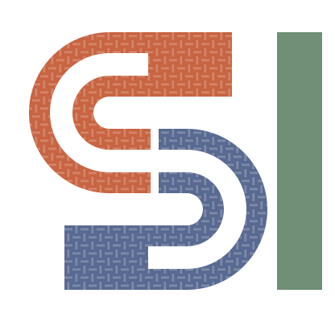
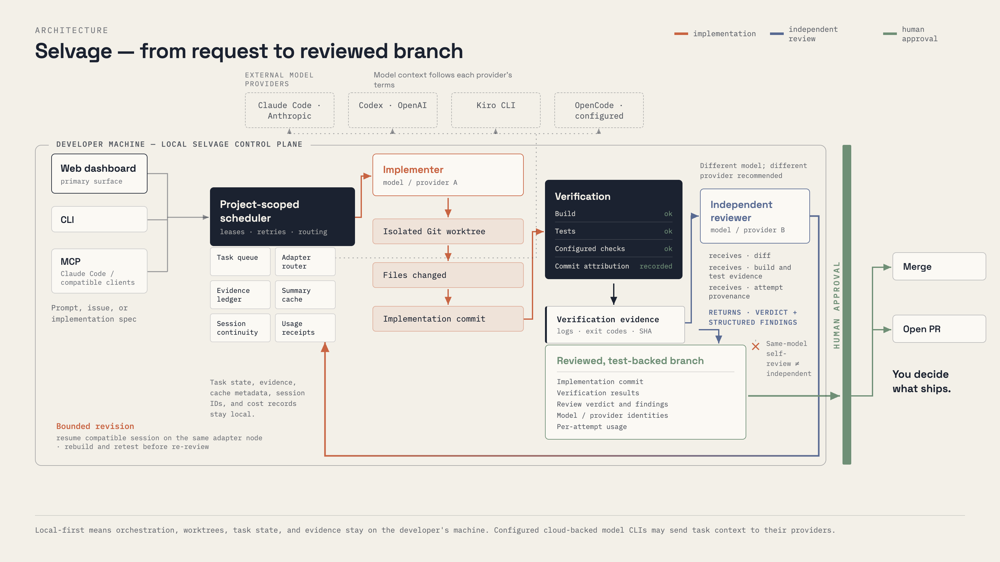

<p align="center">
  <picture>
    <source media="(prefers-color-scheme: dark)" srcset="assets/brand/selvage-symbol-colour-on-dark.svg">
    
  </picture>
</p>

<h1 align="center">Selvage</h1>

<p align="center"><strong>Vibe coding that survives real engineering.</strong></p>

<p align="center">
  Describe what you want. Selvage implements it locally, runs your build and tests,
  routes the change to an independent model for review, and leaves you with a
  reviewed, test-backed branch ready for your approval.
</p>

<p align="center">
  <a href="#quick-start"><strong>Install Selvage</strong></a> ·
  <a href="#from-request-to-reviewed-branch"><strong>See how it works</strong></a>
</p>

<p align="center"><strong>Local-first · Use your AI subscriptions · Independent review · You decide what ships</strong></p>

---

Selvage is an autonomous code implementation pipeline—not merely a verifier or another chat window. It coordinates the work from request to reviewed branch while keeping the engineering controls you already rely on:

- **It implements the change.** An agent works in an isolated Git worktree instead of editing your checkout.
- **It proves what happened.** Builds, tests, commits, findings, usage, and decisions are captured as evidence.
- **It separates implementation from review.** Reviewer identity is recorded, and same-model self-review is not treated as independent review.
- **It uses tools you already pay for.** Bring authenticated Claude Code, Codex, Kiro CLI, or OpenCode installations; Selvage does not resell model tokens.
- **It leaves publication to you.** A human approval gate owns the final decision.

## Quick start

<!-- RELEASE GATE: Do not merge this Homebrew instruction until the public tap has real SHA256 values and a clean brew install has passed. -->

Install from the public Homebrew tap:

```bash
brew install runselvage/selvage/selvage
```

Initialize Selvage inside a Git repository. The setup flow detects installed AI tools, helps select implementation and review tools, and proposes project-specific verification commands.

```bash
cd /path/to/your-project
selvage init
```

Start the local web dashboard:

```bash
selvage ui
```

Open the printed `http://127.0.0.1:<port>` address. Leave the dashboard running, then submit work from another terminal:

```bash
selvage run "add retry logic to the HTTP client with exponential backoff"
```

`run` submits asynchronously. Follow the same task in the browser, or stream its activity in a terminal:

```bash
selvage watch
```

Selvage starts its project-scoped background service automatically; there is no daemon ceremony in the normal workflow.

## From request to reviewed branch

[](assets/visuals/selvage-architecture-3200x1800.png)

<p align="center"><sub>Local orchestration, independent review, and a human-owned shipping decision. Click the diagram for the full-resolution view.</sub></p>

1. **Request:** submit a description, GitHub issue, plan, or MCP task.
2. **Implement:** a configured implementation model works on the change in an isolated Git worktree.
3. **Verify:** configured build and test commands run against the resulting commit.
4. **Review:** an independently identified model evaluates the change and verification results.
5. **Revise:** review findings return for another implementation and verification pass.
6. **Approve:** the dashboard presents the reviewed branch and evidence. You decide what ships.

## Why independent review matters

A model saying its own patch looks correct is useful feedback, but it is not an independent control. Selvage records the implementer and reviewer identities so the review boundary is visible.

For the strongest boundary, configure different providers—for example, an Anthropic-backed implementer and a Kiro- or OpenAI-backed reviewer. The reviewer evaluates the change and verification results, then returns a verdict and findings rather than silently replacing the implementation with an unreviewed commit.

Independence is one part of the trust chain, not the whole product: Selvage also performs the implementation, runs project verification, routes findings back for revision, and preserves the human gate.

## The dashboard is the operating surface

Run `selvage ui` from the project and use the browser to understand what is happening without reconstructing it from terminal logs:

- live task state and streamed implementation activity;
- connected AI tools and available capacity;
- verification results and review findings;
- approval, revision, and rejection decisions;
- task history and evidence attached to the branch.

The CLI remains available for automation and focused operations:

```bash
selvage run "describe the change"
selvage watch <task-id>
selvage approve <task-id>
selvage revise <task-id> --reason "address the concurrency edge case"
selvage task cancel <task-id> --yes
selvage usage <task-id>
```

## A real attempt receipt

Selvage records usage reported by supported tools instead of estimating hypothetical savings. This is one measured production implementation attempt from task `#692`:

| Receipt field | Measured value |
| --- | ---: |
| Implementer | Claude Haiku (Anthropic) |
| Input tokens | 369 |
| Cache-read tokens | 2,116,577 |
| Output tokens | 13,932 |
| Provider-reported cost | **$0.4095** |
| Independent reviewer | Kiro GPT-5.6 Sol |
| Task outcome | Approved |

This is an attempt receipt, not a claim about average task cost, total reviewer spend, or projected savings. A public A/B benchmark will publish fixed prompts, repository revisions, raw transcripts, wall-clock time, verification outcomes, findings, and complete cost methodology.

## Local-first, with an explicit boundary

Selvage keeps orchestration, worktrees, configuration, and task evidence on your machine. It does not require a hosted Selvage control plane, upload your repository to a Selvage cloud, or add another token bill.

Your configured AI CLIs still send the context they need to their respective providers under those providers' terms. “Local-first” describes where orchestration, source control, and evidence live; it does not pretend cloud-backed models run offline.

Worktree isolation protects your active checkout, but it is not a security sandbox. AI tools and verification commands execute with your user permissions. Review `.selvage/config.yaml` before trusting it in an unfamiliar repository.

## Evidence you can inspect

Each reviewed branch includes a concise record of the work:

- the implementation commit;
- configured build and test results;
- the independent review verdict and findings;
- model/provider identities and usage details when available.

The result is a reviewable receipt for how the branch came to exist—not a vague AI confidence score.

## MCP integration

Selvage can be called from Claude Code or another MCP-compatible client while the same task remains visible in the dashboard.

```json
{
  "mcpServers": {
    "selvage": {
      "command": "selvage",
      "args": ["mcp-server", "--repo", "/absolute/path/to/your/project"]
    }
  }
}
```

Available tools:

- `selvage_submit_task` — submit a coding task;
- `selvage_implement_spec` — submit a design or implementation specification;
- `selvage_status` — query task state;
- `selvage_get_evidence` — retrieve verification and review evidence;
- `selvage_record_review` — attach a supplemental review.

## Install

### Homebrew (macOS and Linux)

<!-- RELEASE GATE: Formula/selvage.rb must contain release checksums before this README is merged. -->

```bash
brew install runselvage/selvage/selvage
```

The formula installs both `selvage` and the shorter `slv` alias.

### Release archive

Download the archive for your platform from [GitHub Releases](https://github.com/runselvage/selvage/releases), verify it against `checksums.txt`, and place `selvage` on your `PATH`.

Published archive names follow this pattern:

```text
selvage-darwin-arm64.tar.gz
selvage-darwin-amd64.tar.gz
selvage-linux-arm64.tar.gz
selvage-linux-amd64.tar.gz
```

## Requirements

- Git and a local Git repository;
- at least one supported, authenticated AI CLI on `PATH`;
- project build/test tools required by your verification commands.

Supported CLIs include Claude Code (`claude`), Codex (`codex`), Kiro CLI (`kiro-cli`), and OpenCode (`opencode`). Two independently identified models—and preferably two providers—are recommended for implementation and review.

## Configuration

`selvage init` writes `.selvage/config.yaml`. The setup flow derives initial build and test commands from the repository and lets you choose implementation and review tools. Configuration controls:

- implementation and review tool selection;
- verification commands and timeouts;
- review independence requirements;
- human approval policy.

After changing configuration, validate it and restart the project service:

```bash
selvage adapters doctor
selvage stop
selvage start
```

## More ways to submit work

```bash
# Natural-language request
selvage run "add input validation to the signup form"

# GitHub issue number or URL
selvage run 42

# Several issues, queued in order
selvage run 42 43 44

# Batch plan with aggregate controls
selvage plan run 100 101 102 --max-in-flight 2
```

## Project status

Selvage is under active development. Treat every generated branch as code that still requires your judgment, even when its tests and independent review pass.

- Website: [selvage.run](https://selvage.run)
- Releases: [github.com/runselvage/selvage/releases](https://github.com/runselvage/selvage/releases)
- Issues: [github.com/runselvage/selvage/issues](https://github.com/runselvage/selvage/issues)

## License

Proprietary.
